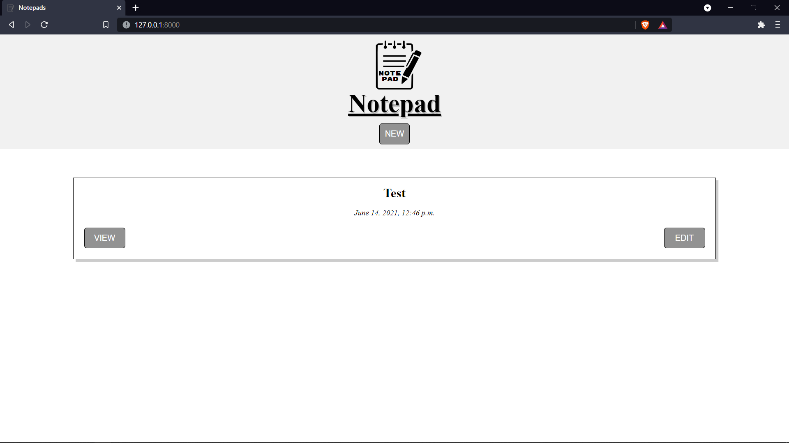
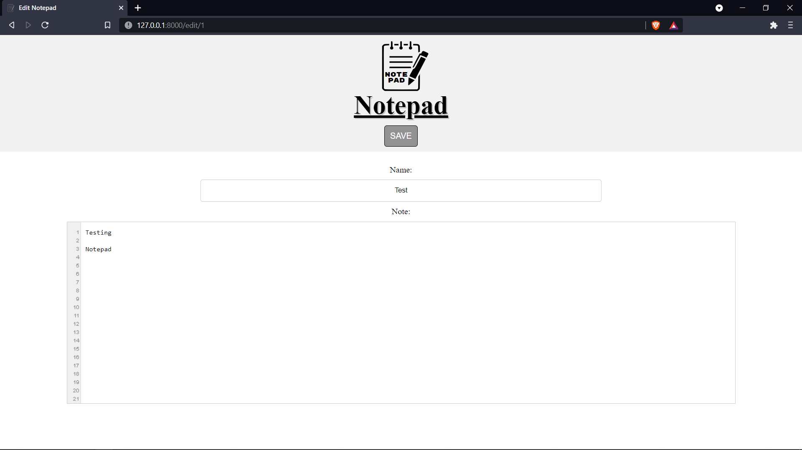
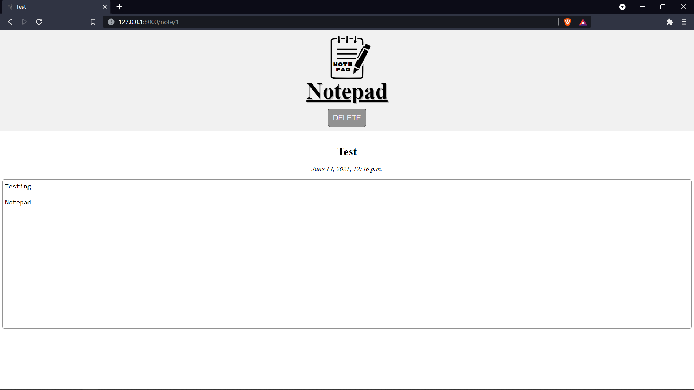

# notepad-django
---
Notepad implemented with django.
---
### To run this project:
1. Clone this repository.
2. In the repository folder run: `python -m venv venv` to create a python virtual environment.
3. To activate the environment run: `venv\Scripts\activate`.
4. Install the dependencies: `pip install -r requirements.txt`.
5. To run app: `python manage.py runserver`.
6. Open your browser and go to: http://127.0.0.1:8000.
7. To exit environment: `venv\Scripts\deactivate`.
---
### Demo
- Notes list   
- Create and edit note   
- View note   
